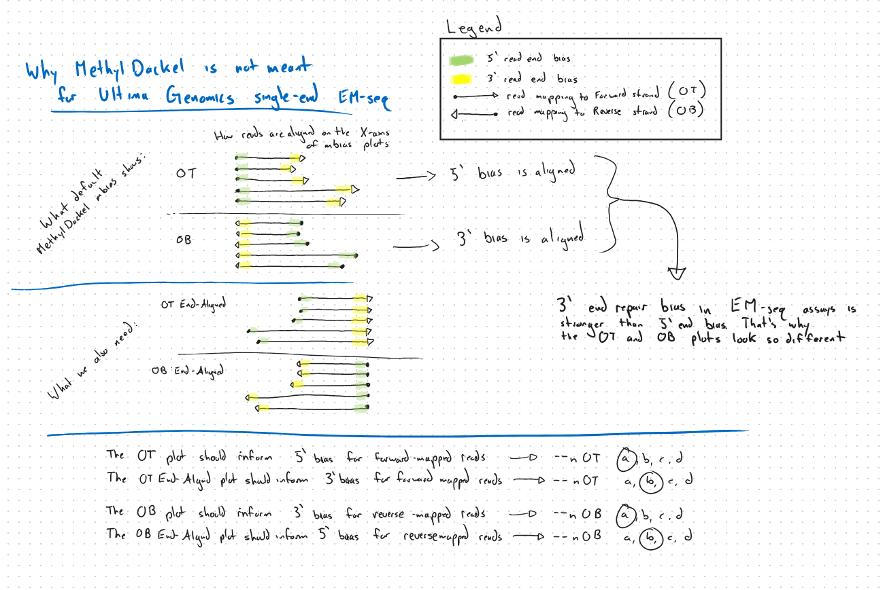

# MethylSEA

This is a fork of MethylSEA, informally named MethylSEA (single end analysis). MethylSEA processes BAM/CRAM files from BS-seq-style libraries to identify methylation bias and extract per-base methylation metrics. The original README for MethylSEA can be found in MethylSEA_README.md or at [MethylSEA's GitHub page](https://github.com/dpryan79/MethylSEA)

# Why MethylSEA?

MethylSEA was designed for data sequenced on Illumina platforms, typically paired-end sequencing with constant read length. Some features therefore fail when used on data from single-end reads with variable length, such as from the Ultima Genomics platform. 

## mbias



`MethylSEA mbias` creates a line plot of the average methylation rate per base pair, indexed by position within the read. Indexing base pairs from 1 within the read aligns reads at the 1st base pair (5' end). With Illumina paired-end sequencing, all reads are the same length, so this process also aligns them at the last base pair (3' end), which makes it simple to identify the number of bases to cut off the 5' and 3' end of each read to account for methylation bias.

With variable length reads, aligning reads originating from the Top (Watson) strand at the 5' end does not align the 3' ends, so in the default `mbias` OT plot, the affect of 3' end repair bias is scattered along the x-axis. This default plot can only inform the number of base pairs affected by 5' methylation bias in OT reads. Crucially, reads originating from the Bottom (Crick) strand are reverse complemented in the BAM file entry, and MethylSEA plots and aligns from left to right (5' to 3' on the reverse complement). Therefore in default `mbias` OB plots, the 3' ends of the original reads are aligned. This plot can only inform the number of base pairs affected by 3' end repair bias in OB reads. Clearly with the default plots, the information for OT 3' bias and OB 5' bias is visually confounded in the plots.

## MethylSEA Features

- mbias plots for all 4 alignment possibilities
  - OT reads aligned at 5' end
  - OT reads aligned at 3' end
  - OB reads aligned at 5' end
  - OB reads aligned at 3' end
- improved X-axis tick labelling on mbias plots
- removed suggested trim bounds from mbias plots

# Installation

Create and activate a conda environment. Install dependencies. Note that you will have to match downstream analysis packages such as `pysam` with the version of htslib you install. For example, htslib==1.23 necessitates pysam==0.24.0.
```
conda create --name methylsea-env
conda activate methylsea-env
conda install bioconda::htslib==1.23 bioconda::libbigwig
```


Clone the fork 
``` 
git clone https://github.com/ofarrelle/MethylSEA
```

Change directory to the cloned repo and build
```
cd ./path/to/MethylSEA
make clean
make \
  CFLAGS="-Wall -g -O3 -pthread -I$CONDA_PREFIX/include" \
  LIBS="-L$CONDA_PREFIX/lib -Wl,-rpath,$CONDA_PREFIX/lib" \
  LIBBIGWIG="-lBigWig"
make test
./MethylSEA --version
```

# Usage

For `mbias`, use the execultable built by `make`:
```
./path/to/MethylSEA/MethylSEA mbias \
    --txt \
    reference_genome.fa alignments.sorted.bam output_prefix
```

> **Note:** `--endAligned` was formerly an optional parameter, but it is now turned on
> by default. The flag is still accepted for backwards compatibility

The produced mbias OT/OB plots are named by the orientation of the original read (not the BAM
alignment, which reverse-complements OB reads), along with which read-indexed base pair is locked on the X-axis

| file | read origin | aligned at |
|------|--------|------------|
| `output_prefix_OT_5prime_aligned.svg` | Original Top | 5' end |
| `output_prefix_OT_3prime_aligned.svg` | Original Top | 3' end |
| `output_prefix_OB_5prime_aligned.svg` | Original Bottom | 5' end |
| `output_prefix_OB_3prime_aligned.svg` | Original Bottom | 3' end |