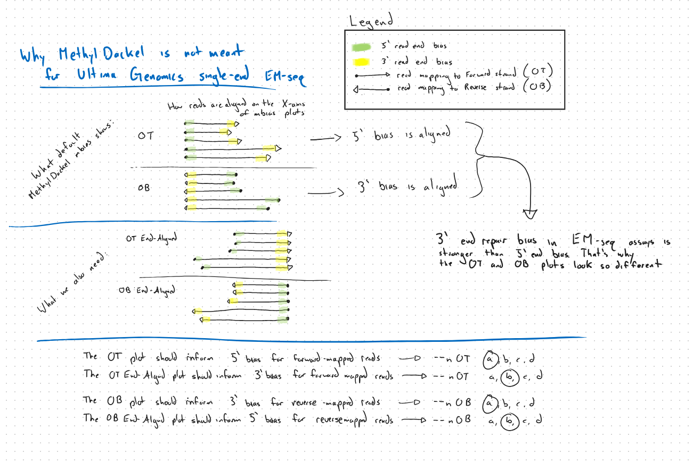

# MethylSEA

This is a fork of MethylDackel, informally named MethylSEA (single end analysis). MethylDackel processes BAM/CRAM files from BS-seq-style libraries to identify methylation bias and extract per-base methylation metrics. The original README for MethylDackel can be found in MethylDackel_README.md or at [MethylDackel's GitHub page](https://github.com/dpryan79/MethylSEA)

# Why not MethylDackel?

MethylDackel was designed for data sequenced on Illumina platforms, typically paired-end sequencing with constant read length. Some features therefore fail when used on data from single-end reads with variable length, such as from the Ultima Genomics platform. Other problems arise from the limited capacity of CLI options for trimming bases in each read.

## mbias



`MethylDackel mbias` creates a line plot of the average methylation rate per base pair, indexed by position within the read. Indexing base pairs from 1 within the read aligns reads at the 1st base pair (5' end). With Illumina paired-end sequencing, all reads are the same length, so this process also aligns them at the last base pair (3' end), which makes it simple to identify the number of bases to cut off the 5' and 3' end of each read to account for methylation bias.

With variable length reads, aligning reads originating from the Top (Watson) strand at the 5' end does not align the 3' ends, so in the default `mbias` OT plot, the affect of 3' end repair bias is scattered along the x-axis. This default plot can only inform the number of base pairs affected by 5' methylation bias in OT reads. Crucially, reads originating from the Bottom (Crick) strand are reverse complemented in the BAM file entry, and MethylDackel plots and aligns from left to right (5' to 3' on the reverse complement). Therefore in default `mbias` OB plots, the 3' ends of the original reads are aligned. This plot can only inform the number of base pairs affected by 3' end repair bias in OB reads. Clearly with the default plots, the information for OT 3' bias and OB 5' bias is visually confounded.

## extract

Analysis of mbias results of long cfDNA fragments shows the average methylation drops significantly from ~75% to ~50% after the 140th base pair of every read, independently of 3' end repair bias from EM-seq assays (referred to as "Native Degradation"). While appearing to be a signature of cell free DNA, the mechanism behind Native Degradation has not yet been elucidated. Depending on the goals of a project, a simple solution to avoid bias and model complexity introduced by this effect is to ignore base pairs after the 140th of each read. In an ideal world, this procedure would first involve trimming the 3' end of a read for 3' end repair bias, trimming the remaining length of the read beyond the 140th base pair, and finally trimming for 5' end methylation bias.

The built in paramters `--OT` and `--nOT` for `MethylDackel extract` can accomplish this goal for reads mapping to the forward strand. However for reads mapping to the reverse strand, the bounds provided in the `--OB` and `--nOB` parameters are indexed from the beginning of the BAM entry, which is reverse-complemented from the original read. Trimming beyond the Native Degradation point in this case is simply not possible with the available CLI options.

# MethylSEA Features

### `mbias`
- mbias plots for all 4 alignment possibilities
  - OT reads aligned at 5' end
  - OT reads aligned at 3' end
  - OB reads aligned at 5' end
  - OB reads aligned at 3' end
- `--txt` output for all 4 plots
- improved X-axis tick labelling on mbias plots
- removed suggested trim bounds from mbias plots
- option to use `--five-prime-trim`, `--three-prime-trim`, and `--max-length` (see `extract` documentation below)

### `extract`
- new base pair trimming options oriented to the biological 5' end of the original read. Behavior is symmetrical for reads from both strands.
  - `--five-prime-trim` - number of bases to ignore at the 5' end of the original read due to methylation bias
  - `--three-prime-trim` - number of bases to ignore at the 3' end of the original read due to methylation bias
  - `--max-length` - ignore all bases beyond this index (exclusive)

# Installation

Create and activate a conda environment. Install dependencies. Note that you will have to match downstream analysis packages such as `pysam` with the version of htslib you install. For example, htslib==1.23 necessitates pysam==0.24.0.
```
conda create --name methylsea-env
conda activate methylsea-env
conda install bioconda::htslib==1.23 bioconda::libbigwig
```


Clone the fork 
``` 
git clone https://github.com/ofarrelle/MethylSEA
```

Change directory to the cloned repo and build
```
cd ./path/to/MethylSEA
make clean
make \
  CFLAGS="-Wall -g -O3 -pthread -I$CONDA_PREFIX/include" \
  LIBS="-L$CONDA_PREFIX/lib -Wl,-rpath,$CONDA_PREFIX/lib" \
  LIBBIGWIG="-lBigWig"
make test
./MethylSEA --version
```

# Usage

For `mbias`, use the execultable built by `make`:
```
./path/to/MethylSEA/MethylSEA mbias \
    --txt \
    reference_genome.fa alignments.sorted.bam output_prefix
```

> **Note:** `--endAligned` was formerly an optional parameter, but it is now turned on
> by default. The flag is still accepted for backwards compatibility

The produced mbias OT/OB plots are named by the orientation of the original read (not the BAM
alignment, which reverse-complements OB reads), along with which read-indexed base pair is locked on the X-axis

| file | read origin | aligned at |
|------|--------|------------|
| `output_prefix_OT_5prime_aligned.svg` | Original Top | 5' end |
| `output_prefix_OT_3prime_aligned.svg` | Original Top | 3' end |
| `output_prefix_OB_5prime_aligned.svg` | Original Bottom | 5' end |
| `output_prefix_OB_3prime_aligned.svg` | Original Bottom | 3' end |
